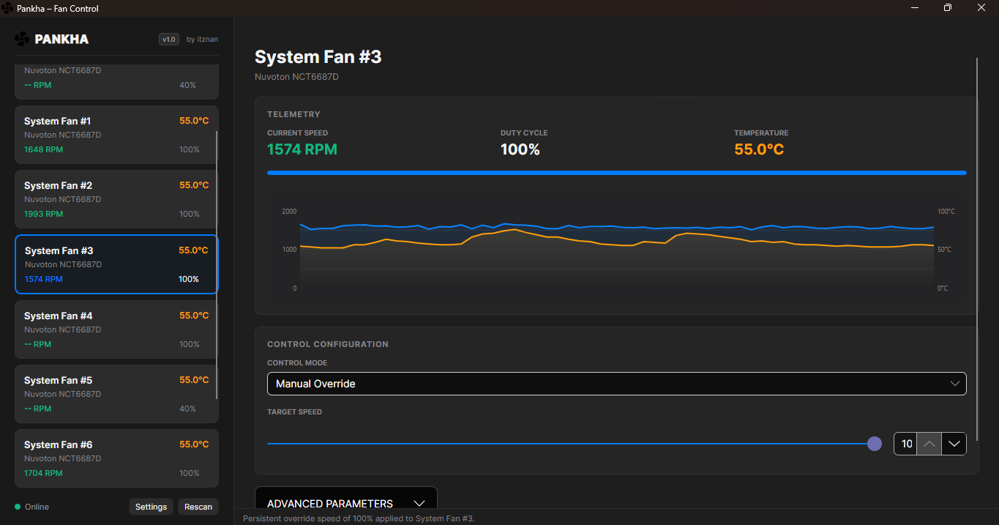

<p align="center">
  
</p>

<h1 align="center">Pankha</h1>

<p align="center">
  <strong>A premium, lightweight, unified fan control application for Windows</strong>
</p>

<p align="center">
  <a href="https://github.com/itznan/pankha/actions/workflows/release.yml">
    
  </a>
  <a href="https://github.com/itznan/pankha/releases/latest">
    
  </a>
  
  
  
  
</p>

<p align="center">
  <em>Pankha (পাখা / पंখা) — Bengali/Hindi word for "Fan"</em>
</p>

<p align="center">
  
</p>

---

## ✨ Features

| Feature | Description |
|---|---|
| 🎨 **macOS-Inspired UI** | Sequoia-inspired Light & Dark modes featuring beautiful curves, modern typography, glassmorphism effects, and smooth animations |
| 🌀 **Granular Fan Control** | Take control of motherboard, CPU, and GPU fan channels with custom speeds (0% – 100%) or restore automatic hardware curve control |
| ⚡ **Zero-Latency Monitoring** | Live updates of RPM levels, control percentages, and multiple sensor temperatures (CPU, GPU, and motherboard) |
| ⚙️ **Automatic Driver Setup** | Seamless detection and background installation of the required **PawnIO kernel driver** if missing on start |
| 📉 **Interactive Charts** | Smooth, high-fidelity real-time telemetry graphs showing sensor readouts and calibration metrics |
| 🔽 **Minimize-to-Tray** | Runs unobtrusively in the Windows system tray. Double-click the tray icon to bring it back to focus |
| 🚀 **Start on Boot** | Optional registry configuration to launch silently in the system tray when Windows boots up |
| 💾 **Settings Persistence** | Saves all window preferences, poll interval, theme options, and custom startup behaviors to the registry |
| 📦 **Portable & Installable** | Compile to a single self-contained executable, or package with Inno Setup into a clean one-click installer |

---

## 🏛️ Architecture

Pankha has been completely rewritten into a **single-process native .NET 10.0 C# Desktop Application** built on **Avalonia UI**. This removes all intermediate HTTP server overhead and process synchronization issues, delivering high performance and low resource consumption.

```
┌──────────────────────────────────────────┐
│            Pankha (Avalonia UI)          │
│   - Modern Views & Charts (XAML)         │
│   - ViewModels & Application Logic       │
└─────────────────────┬────────────────────┘
                      │ Direct Call
                      ▼
┌──────────────────────────────────────────┐
│        LibreHardwareMonitorLib           │
└─────────────────────┬────────────────────┘
                      │ Driver API
                      ▼
┌──────────────────────────────────────────┐
│         PawnIO Kernel Driver             │
│      (Low-Level Hardware Access)         │
└─────────────────────┬────────────────────┘
                      │ Read / Write
                      ▼
┌──────────────────────────────────────────┐
│    Hardware Sensors & Fan Controllers    │
│         (Motherboard, CPU, GPU)          │
└──────────────────────────────────────────┘
```

1. **Avalonia UI Presentation**: Code-behind, styles, custom telemetry charts, and VM properties run in a single process.
2. **Telemetry Service**: Direct C# bindings call `LibreHardwareMonitorLib`.
3. **PawnIO Kernel Driver**: Windows requires low-level kernel driver registration (`PawnIO`) to poll motherboard controllers and Super I/O chips safely. Pankha automatically installs it if not present.
4. **Elevation Requirement**: Because kernel driver interactions require administrator rights, the application manifest requests UAC elevation.

---

## 📁 Repository Structure

```
pankha/
├── src/                            # C# .NET 10.0 Source Code
│   ├── App.axaml                   # Application initialization markup
│   ├── App.axaml.cs                # Checks PawnIO driver prerequisite & starts windows
│   ├── Program.cs                  # Classic desktop lifetime launcher
│   ├── app.manifest                # UAC Administrator execution manifest
│   ├── pankha.csproj               # Project dependencies and MSBuild instructions
│   │
│   ├── Assets/                     # Application icons and PNG logo assets
│   ├── icons/                      # Windows compiler executable icon
│   │
│   ├── Components/                 # Custom graphic controls
│   │   ├── CalibrationChart.cs     # Interactive fan curve calibration graph
│   │   ├── TelemetryChart.cs       # Real-time visual monitoring charts
│   │   └── SmoothScroll.cs         # Smooth, physics-based inertial scrolling
│   │
│   ├── Services/                   # Hardware APIs & configurations
│   │   ├── FanController.cs        # Integrates LibreHardwareMonitor with CPU/GPU/Motherboard
│   │   ├── PawnIOChecker.cs        # Automatic downloader & silent installer for PawnIO driver
│   │   └── RegistrySettingsManager.cs # Configures app preferences & Start-on-Boot registry keys
│   │
│   ├── ViewModels/                 # MVVM bindings
│   │   ├── MainWindowViewModel.cs  # Directs settings, timer polling, & sensor telemetry
│   │   ├── FanViewModel.cs         # Single-fan interactive logic, modes, & calibration
│   │   └── ViewModelBase.cs        # INotifyPropertyChanged base definition
│   │
│   └── Views/                      # XAML User Interfaces
│       ├── MainWindow.axaml        # Core window, sidebar, and fan lists layout
│       └── PawnIOInstallWindow.axaml# Custom prompt for the PawnIO driver dependency
│
├── installer/
│   └── setup.iss                   # Inno Setup 6 script to compile the Windows installer
│
├── .github/workflows/
│   └── release.yml                 # CI/CD: build, package, and release installer on tags
│
└── build.bat                       # Automated build, publish & installer packaging script
```

---

## 🔧 Build & Run Instructions

### Prerequisites

* **.NET 10.0 SDK** (Installed globally or downloaded locally via `build.bat`)
* **Inno Setup 6** (Optional, to package the application installer)

### Quick Build with automated script

Run the included build script. It automatically ensures the correct SDK version is available, compiles the project self-contained, deploys it to a `dist/` directory, and compiles the installer:

```powershell
.\build.bat
```

### Manual CLI Publish

To manually publish a standalone execution bundle without `build.bat`:

```powershell
dotnet publish src/pankha.csproj -c Release -r win-x64 --self-contained true
```

The output executables, assemblies, and DLLs will be produced inside:
`src/bin/Release/net10.0-windows/win-x64/publish/`

---

## ⚙️ Configuration & Registry Settings

Pankha avoids configuration files on disk, storing user choices directly inside the **Windows Registry**:

| Key Path | Entry Name | Description |
|---|---|---|
| `HKCU\Software\itznan\Pankha` | `Theme` | `Light` or `Dark` UI appearance |
| `HKCU\Software\itznan\Pankha` | `PollInterval` | Timing frequency for hardware readouts (in milliseconds) |
| `HKCU\Software\itznan\Pankha` | `MinToTray` | True/False setting for minimizing window to notification tray |
| `HKCU\Software\itznan\Pankha` | `StartOnBoot` | True/False setting for starting automatically |
| `HKCU\Software\Microsoft\Windows\CurrentVersion\Run` | `Pankha` | Shortcut launch command triggering silent boot starts |

---

## 🤝 Contributing

We welcome contributions to make Pankha better! 

1. **Fork** the repository
2. **Create** a branch: `git checkout -b feature/awesome-feature`
3. **Commit** your modifications: `git commit -m "feat: add beautiful telemetry curves"`
4. **Push** to the origin: `git push origin feature/awesome-feature`
5. **Open** a Pull Request

---

## 📄 License

This project is open-source. For licensing details, please refer to the repository's license.

---
<p align="center">
  Made with ❤️ by <a href="https://github.com/itznan">itznan</a>
</p>
